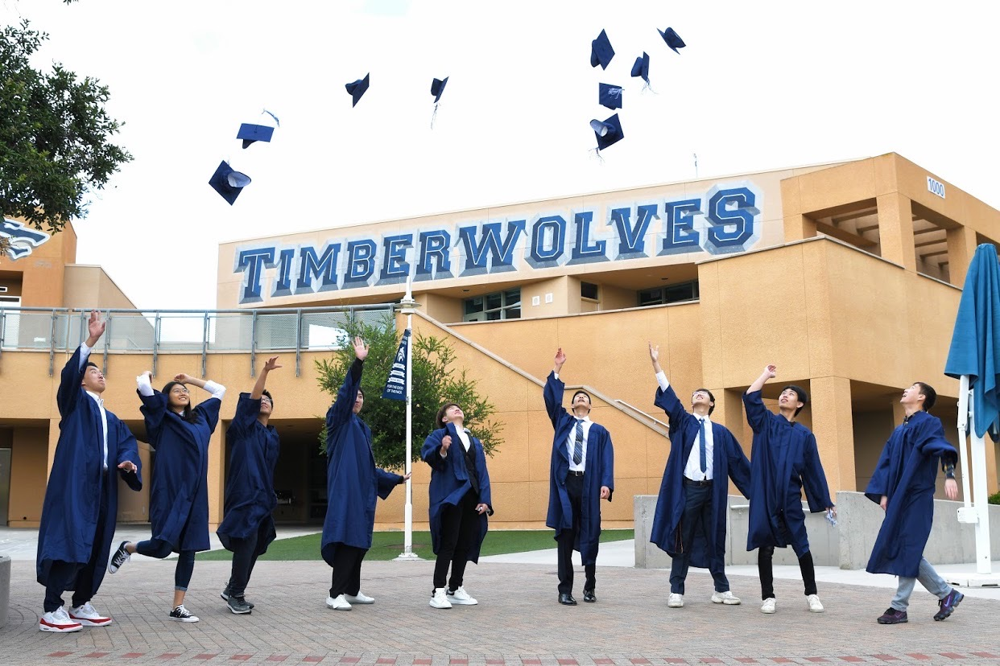
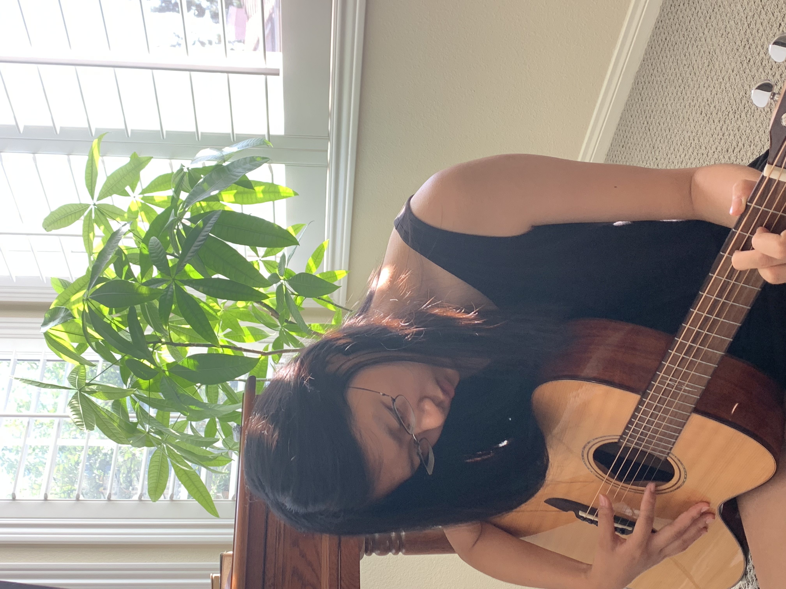

## ABOUT ME

It is my hope to one day work in the area of computer science and artificial intelligence. I am intrigued and fascinated by the seemingly unlimited potential of these areas of study and development to improve the quality of life. It is my desire to learn as much as possible about all areas of computer science and the development of artificial intelligence.

---

### Research Experiences
(June 2022 - present)
Working on projects of designing an AI chatbot with emphasis on security and privacy and Studying people's reactions on misinformation and disinformation on twitter under the supervision of Dr.Munyaka in SEISUP Lab. 

(August 2021 - present)
Collaborating with other three students: James Cole, Daniel Hernandez, and Nikki Rejai in Dr. Sahoo’s [Boolean research lab](https://sites.google.com/view/debashis-sahoo) on generating a *gene expression signature* for tuberculosis with higher accuracy under any diseases' conditions. 

(April 2019 - June 2020)
Collecting Water Samples and analyzing samples using IDEXX Quanti-tray/Enterolert method to detect any enterococci contamination for [Surfrider Foundation](https://www.surfrider.org/) and [Irvine Water District](https://www.irwd.com/).
 
### Awards 
- (June 2022) Recipient of the Gary C Reynolds Scholarship @UC San Diego for exceptional promise in making future contributions in the field of Math-Computer Science 
- (Spring 2021 - present) Marshall College Honors program
- (Spring 2021 - present) Provost Honors 

### Projects
Mini Project on creating a chatbot: [Soical chatbot](). 

Mini Project on analyzing sentiments among all comments within a youtube video related to gun controls: [Sentiment Analysis on Gun Control Video on youtube](). 

Collaborating with 4 other UCSD students, I completed the first project in Data Science: [Exploring traffic patterns in the San Diego area](https://github.com/xiw013/SD-Traffic-Collision.git). We hope that this project will be used to create safer and more efficient communities for everyone.

---

## Extracurricular Activity
- Principal member and Social Media/Marketing co-chair of the [Association for Women in Mathematics](https://awm-math.org/), UCSD undergraduate branch.
- Founding member of [Triton Translator](https://sites.google.com/ucsd.edu/triton-translators/home?authuser=0) which is an organization dedicated to providing translation support for community organizations in the SD area.
- Social Justice Ambassador Intern for [Orange County Human Relations Commissions](https://www.ochumanrelations.org/), Santa Ana, CA

Aside from academics, I also love playing music, painting, hiking, and traveling! Here are some photos about me:

My high school graduation

